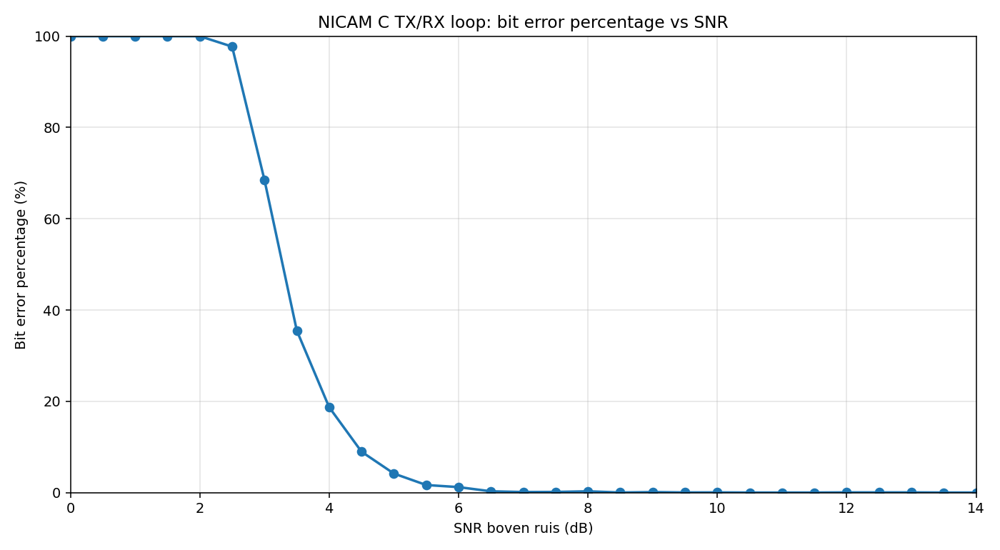
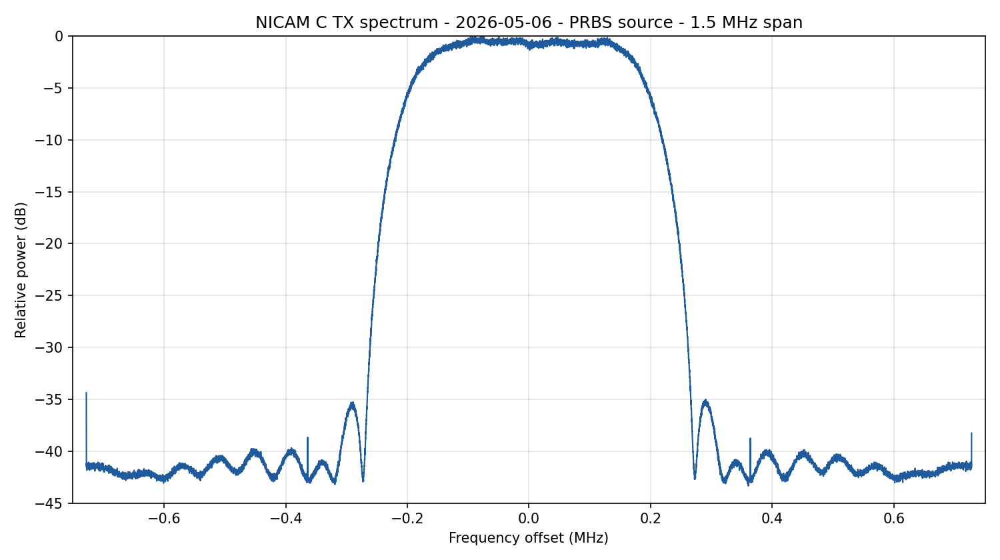

# NICAM direct QPSK experiments

Dit project is opgezet voor experimenten waarbij het NICAM DQPSK-signaal direct
op RF wordt gezet, dus zonder analoge TV-draaggolf/subcarrierketen. De huidige
keten bevat een echte NICAM 728 payload encoder/decoder, een standalone
C-zender voor PlutoSDR en een standalone C-ontvanger voor live RTL-SDR
ontvangst.

De NICAM Python-prototypes zijn uitgefaseerd; de normale NICAM TX/RX-paden
lopen via de C-programma's `nicam-pluto-tx` en `nicam-rx`.

## Signaalparameters

- NICAM bitrate: `728 kbit/s`
- DQPSK symbolrate: `364 ksym/s`
- Praktische RF-bandbreedte (deze implementatie): ongeveer `500-750 kHz`
- Frame: `728 bits`, dus `1 ms`
- FAW: `01001110`
- Scrambler: PN9, polynomial `x^9 + x^4 + 1`, seed `111111111`
- Audio: stereo, 32 kHz, NICAM 728 near-instantaneous companding
- Direct-QPSK mode: stem de RTL-SDR af op de NICAM RF-carrier zelf

Voor de eerste receiver is `1.456 MS/s` gekozen, precies 4 samples per DQPSK
symbool. Dat houdt de timing in deze experimentele versie eenvoudig.

## Standalone C-ontvanger

Voor live gebruik op de Odroid is er een standalone C-programma met de naam
`nicam-rx`. Dit programma heeft geen Python nodig tijdens runtime:

- stdin: `rtl_sdr`-achtige unsigned 8-bit IQ (`I,Q,I,Q,...`)
- stdout: raw stereo `s16le` audio op `32 kHz`
- stderr: lock/statusmeldingen bij `--verbose`

Standaard verwacht `./nicam-rx` `rtl_sdr`-compatibele `u8` IQ. Voor andere SDR
hardware of offline bestanden kan ook interleaved signed 16-bit IQ worden
gelezen:

```sh
./nicam-rx --iq-format s16 --sample-rate 1456000 < input.cs16 > output.pcm
```

Compileren:

```sh
make
```

Dit bouwt:

```sh
./nicam-rx
```

De Makefile gebruikt alleen een C compiler en `libm`. Op Debian/Ubuntu/Odroid:

```sh
sudo apt install build-essential rtl-sdr alsa-utils
make
```

De C-code is gewone C11 en bevat geen x86-specifieke intrinsics. Hij is bedoeld
om ook op ARM64/Odroid te compileren met `gcc` of `clang`.

Live luisteren met RTL-SDR en ALSA:

```sh
rtl_sdr -f 54552000 -s 1456000 -g 29.7 - \
  | ./nicam-rx --sample-rate 1456000 --verbose \
  | aplay -f S16_LE -r 32000 -c 2
```

Met een LO van `48 MHz` en een NICAM subcarrier op `6.552 MHz` is de gewenste
RTL-SDR frequentie:

```text
48.000 MHz + 6.552 MHz = 54.552 MHz
```

Als je liever via `ffplay` luistert:

```sh
rtl_sdr -f 54552000 -s 1456000 -g 29.7 - \
  | ./nicam-rx --sample-rate 1456000 --verbose \
  | ffplay -hide_banner -loglevel error -nodisp \
      -f s16le -sample_rate 32000 -ch_layout stereo -i -
```

Voor het upconverter-testplan:

- Digital Baseband NICAM op `6.552 MHz`
- LO op `48 MHz`
- 50-70 MHz filter na de mixer
- RTL-SDR op `54.552 MHz`

De C-decoder is getest tegen dezelfde IQ-bestanden als de Python ontvanger. Op
een 30 seconden 10 dB SNR testbestand gaf `./nicam-rx` exact dezelfde audio-samples
als de Python ontvanger en decodeerde hij ongeveer in real-time factor 30
sneller dan nodig.

## Installatie

Kies de methode die past bij de target machine.

Optie A: user-installatie (zonder venv):

```sh
python3 -m pip install --user -r requirements.txt
python3 -m pip install --user -e .
```

Optie B: virtual environment (`venv`):

```sh
python3 -m venv .venv
. .venv/bin/activate
pip install -r requirements.txt
pip install -e .
```

Daarnaast moet de `rtl_sdr` command line tool beschikbaar zijn, bijvoorbeeld uit
het pakket `rtl-sdr`. Voor `--stream-url` en `--audio-file` is ook `ffmpeg`
nodig.

Voor systemd user-services is het aan te raden overal `python3` te gebruiken,
zodat je niet afhankelijk bent van een eventuele andere `python` default op het
systeem.

## C ontvanger starten

Voor NICAM RX is `./nicam-rx` de enige ondersteunde decoder. Live luisteren via
RTL-SDR loopt via de host-launcher:

```sh
NICAM_RX_GAIN=29.7 NICAM_RX_MATCHED_FILTER=1 tools/websdr-nicam-rx
```

Een opgeslagen IQ-bestand terugluisteren:

```sh
./nicam-rx --sample-rate 1456000 --matched-filter < /tmp/radio2-nicam.iq \
  | aplay -f S16_LE -r 32000 -c 2
```

Belangrijke live-opties:

- `--freq`: frequentie van de directe NICAM QPSK carrier in Hz
- `--ppm`: RTL-SDR correctie
- `--gain`: tuner gain, of `auto`
- `--sample-rate`: standaard `1456000`
- `--iq-in`: lees IQ uit een bestand in plaats van live van `rtl_sdr`
- `--matched-filter`: gebruik het RRC matched filter bij RRC-vormgegeven TX

## Audio stream moduleren

Voor end-to-end testen kan de C-zender audio naar echte NICAM 728 payloads
encoderen en daarna naar direct-QPSK IQ moduleren. Met `--iq-out` schrijft hij
een `rtl_sdr`-achtige unsigned 8-bit IQ-stream naar een bestand in plaats van
naar PlutoSDR.

Een testtoon naar direct-QPSK IQ moduleren:

```sh
./nicam-pluto-tx --source tone --seconds 5 --iq-out /tmp/nicam-tone.iq
```

NICAM carrier level kan op dezelfde schaal als de PE1MUD/PE1OBW Digital Baseband
worden gezet:

```sh
./nicam-pluto-tx --source tone --nicam-rf-level 200 --seconds 5 --iq-out /tmp/nicam.iq
```

Hierbij is `200` ongeveer `-14.2 dBFS`, want:

```text
20 * log10(200 / 1023) = -14.2 dB
```

Een internetstream naar een IQ-bestand moduleren:

```sh
ffmpeg -hide_banner -loglevel error -reconnect 1 -reconnect_streamed 1 -reconnect_delay_max 5 \
  -i "https://icecast.omroep.nl/radio2-bb-aac" -vn -f s16le -ac 2 -ar 32000 - \
  | ./nicam-pluto-tx --source pcm --pcm-in - --seconds 30 --iq-out /tmp/radio2-nicam.iq
```

Met de C-decoder kun je hetzelfde IQ-bestand terugluisteren:

```sh
./nicam-rx --sample-rate 1456000 --matched-filter --verbose < /tmp/radio2-nicam.iq \
  | aplay -f S16_LE -r 32000 -c 2
```

### Huidige NICAM TX-praktijksetup

Voor live zenden is de voorkeursopzet nu een constante lokale audiobus in de
zender. De TX-clock blijft altijd lopen; externe audio wordt via UDP op de bus
gezet. Als er geen UDP-packets binnenkomen, zendt de NICAM-keten stilte en
blijven de frames/IQ-samples doorlopen.

Normaal starten op `tim`:

```sh
NICAM_TX_SOURCE=udp NICAM_TX_UDP_URL=udp://0.0.0.0:7355 tools/tim-nicam-tx
```

Digital Baseband V1.4-compatible station-ID in de NICAM additional-data bits:

```sh
NICAM_TX_STATION_ID=PE1ITR tools/tim-nicam-tx
```

Alleen de eerste 8 ASCII-tekens worden gebruikt. De mapping is:
`AD0..AD2 = tekenpositie 0..7`, `AD3..AD10 = ASCII-teken`.

Een bron naar de zender sturen:

```sh
ffmpeg -hide_banner -loglevel error -re -i input \
  -vn -ac 2 -ar 32000 -f s16le \
  'udp://zender-ip:7355?pkt_size=1024'
```

Belangrijk:

- Gebruik `-re` of een bron die zelf op audioclock uitstuurt. Zonder pacing kan
  UDP-audio bursty aankomen en moet de zenderbuffer samples droppen.
- UDP-audioformaat voor NICAM is raw stereo `s16le` op `32 kHz`.
- Bij `NICAM_TX_SOURCE=udp` leest `tools/tim-nicam-tx` raw stereo `s16le` audio
  via `ffmpeg` en voert dat aan de C-zender.
- De C-zender gebruikt standaard root-raised-cosine pulse shaping met
  `NICAM_TX_PULSE_ROLLOFF=0.4` en `NICAM_TX_PULSE_SPAN_SYMBOLS=6`.

De relevante profieldefaults staan in `config/environments/tim.env.example`:

```sh
NICAM_TX_SOURCE=stream              # zet live op udp
NICAM_TX_UDP_URL=udp://0.0.0.0:7355
NICAM_TX_PULSE_SHAPE=1
NICAM_TX_PULSE_ROLLOFF=0.4
NICAM_TX_PULSE_SPAN_SYMBOLS=6
```

Referentiemetingen:

- C TX/RX bit-error sweep, SNR `0..14 dB` in stappen van `0.5 dB`
  (`7,280,000` uitgezonden bits; bad frames en gemiste frames tellen als
  bitfouten):

  
- C TX-spectrum van dezelfde PRBS-bron, 1.5 MHz span, relatieve schaal
  `0..-45 dB`:

  
- Decoder threshold, final filter vs baseline:
  `artifacts/nicam-final/nicam-final-lpf49-425k-error-percent-vs-baseline-latest.png`
- Final spectrum, 2 MHz span tot `-40 dB`:
  `artifacts/nicam-final/nicam-final-lpf49-425k-spectrum-2mhz-latest.png`
- Klikpuls-delayverdeling:
  `artifacts/nicam-snr-sweep-30s/nicam-click-delay-split.png`

## PlutoSDR uitzenden

De native C-zender stuurt direct naar PlutoSDR via libiio:

```sh
tools/build-nicam-pluto-tx
./nicam-pluto-tx --lo 100000000 --tx-gain -30 --source tone
```

Met een audiostream:

```sh
tools/tim-nicam-tx
```

Belangrijke Pluto-opties:

- `--lo`: RF-carrier in Hz
- `--uri`: standaard `ip:192.168.2.1`
- `--sample-rate`: standaard `1456000`
- `--tx-gain`: Pluto TX hardware gain/attenuation in dB, begin laag, bijvoorbeeld `-40` tot `-30`
- `--rf-bandwidth`: standaard `750000`
- `--source`: `tone`, `silence` of `pcm`
- `--pcm-in`: raw stereo `s16le` audio op `32 kHz`, of `-` voor stdin
- `--iq-out`: schrijf test-IQ naar bestand in plaats van Pluto TX

Voor een korte offline test kun je eerst IQ maken:

```sh
./nicam-pluto-tx --source tone --seconds 1 --iq-out /tmp/nicam-tone.iq
./nicam-rx --sample-rate 1456000 --matched-filter < /tmp/nicam-tone.iq > /tmp/nicam-tone.pcm
```

## WBFM-zender

Naast de directe NICAM/QPSK-keten bevat het project ook een experimentele stereo
WBFM-zender voor PlutoSDR. Deze maakt een FM-MPX-signaal met L+R, 19 kHz pilot
en L-R DSB-subcarrier, moduleert dat naar complex baseband IQ en kan dit direct
naar de Pluto sturen.

De standaardinstellingen staan in `config/config.yaml`. Test eerst offline of de
audio-naar-IQ-keten werkt:

```sh
PYTHONPATH=src python3 -m wbfm_tx.main \
  --config config/config.yaml \
  --source wav \
  --input test_audio/voorbeeld.wav \
  --iq-out /tmp/wbfm.complex64 \
  --seconds 2
```

Uitzenden via PlutoSDR:

```sh
PYTHONPATH=src python3 -m wbfm_tx.main \
  --config config/config.yaml \
  --freq 2323.7 \
  --gain -30 \
  --source wav \
  --input test_audio/voorbeeld.wav \
  --cyclic
```

Na een editable install kun je ook `wbfm-tx` gebruiken in plaats van
`python3 -m wbfm_tx.main`.

Belangrijke WBFM-opties:

- `--freq`: Pluto TX LO in MHz
- `--gain`: Pluto TX hardware gain in dB; begin laag
- `--source`: `wav`, `stream`, `device` of `silence`
- `--iq-out`: schrijf complex64 baseband IQ naar een bestand in plaats van TX
- `--deviation`: FM-deviatie in Hz, standaard `75000`
- `--preemphasis-us`: pre-emphasis, standaard `50`
- `--pilot-level`: 19 kHz pilotniveau

## WBFM broadcast ontvangen

De RTL-SDR WBFM-ontvanger decodeert standaard stereo broadcast-FM: FM
discriminator, 19 kHz pilot, L-R subcarrier, 50 us de-emphasis en stereo PCM.
De stereo-decoder gebruikt standaard gedeeltelijke stereo-blend om L-R-ruis te
beperken.

Naar WAV opnemen:

```sh
PYTHONPATH=src python3 -m wbfm_rx.rtl_rx \
  --device-index 1 \
  --freq 100700000 \
  --sample-rate 960000 \
  --gain 29.7 \
  --audio-out /tmp/wbfm-rx.wav
```

Live luisteren met `ffplay`:

```sh
PYTHONPATH=src python3 -m wbfm_rx.rtl_rx \
  --device-index 1 \
  --freq 100700000 \
  --sample-rate 960000 \
  --gain 29.7 \
  --audio-out - \
  | ffplay -hide_banner -loglevel error -nodisp \
      -f s16le -sample_rate 48000 -ch_layout stereo -i -
```

Een offline WBFM IQ-bestand uit de zender terugdecoderen kan met:

```sh
PYTHONPATH=src python3 -m wbfm_rx.rtl_rx \
  --iq-in /tmp/wbfm.complex64 \
  --iq-format complex64 \
  --audio-out /tmp/wbfm-loop.wav
```

Na een editable install kun je ook `wbfm-rx` gebruiken in plaats van
`python3 -m wbfm_rx.rtl_rx`.

Bij ruis eerst mono vergelijken:

```sh
tools/websdr-wbfm-rx --mono
```

Daarna stereo-blend instellen. Lager is rustiger, hoger is breder stereo:

```sh
tools/websdr-wbfm-rx --stereo-blend 0.35
tools/websdr-wbfm-rx --stereo-blend 1.0
```

De ontvanger heeft standaard pilot-squelch. Als de zender wegvalt en de 19 kHz
pilot onvoldoende is, fade't de audio dicht:

```sh
tools/websdr-wbfm-rx --verbose
tools/websdr-wbfm-rx --squelch-pilot 0.12
tools/websdr-wbfm-rx --no-squelch
```

## Machineprofielen en uniforme start

Voor machines met verschillende Python-installaties en audio-uitgangen staat er
een launcher in `tools/nicam-run`. Die laadt eerst een profiel uit
`config/environments/` en start daarna de juiste module met dezelfde commando's
op elke host.

Profielkeuze:

```sh
tools/nicam-run wbfm-rx ...
NICAM_ENV=websdr tools/nicam-run nicam-rx ...
NICAM_ENV_FILE=/opt/nicam/local.env tools/nicam-run wbfm-tx ...
```

Zonder override zoekt de launcher automatisch:

```sh
config/environments/$(hostname -s).env
```

Voorbeeldprofielen staan in:

- `config/environments/websdr.env.example`
- `config/environments/odroid.env.example`
- `config/environments/desktop.env.example`
- `config/environments/user-install.env.example`

De belangrijkste profielvelden:

```sh
PYTHON_MODE=src        # src, user of venv
PYTHON_BIN=python3
VENV_PATH=${REPO_DIR}/.venv
AUDIO_BACKEND=aplay   # stdout, ffplay, aplay of none
AUDIO_DEVICE=plughw:0,0
NICAM_AUDIO_RATE=32000
WBFM_AUDIO_RATE=48000
```

Voorbeelden:

```sh
tools/nicam-run nicam-rx --device-index 1 --freq 435970000 --gain 29.7
tools/nicam-run wbfm-rx --device-index 1 --freq 100700000 --gain 29.7
tools/nicam-run wbfm-tx --config config/config.yaml --source stream --stream-url "https://icecast.omroep.nl/radio2-bb-aac"
```

WebSDR/Odroid WBFM shortcut, met `config/environments/websdr.env` en standaard
`436000000` Hz:

```sh
tools/websdr-wbfm-rx
```

Tijdelijk overschrijven:

```sh
GAIN=29.7 FREQ_HZ=436000000 tools/websdr-wbfm-rx
tools/websdr-wbfm-rx --mono
```

Tim WBFM-zender shortcut, met `.venv` en standaard `2324 MHz`:

```sh
cp config/environments/tim.env.example config/environments/tim.env
tools/tim-wbfm-tx
```

Tijdelijk overschrijven:

```sh
TX_GAIN_DB=-15 tools/tim-wbfm-tx
TX_FREQ_MHZ=2324 TX_STREAM_URL="https://icecast.omroep.nl/radio2-bb-aac" tools/tim-wbfm-tx
```

Bij korte internetstream-haperingen blijft de WBFM-zender standaard doorlopen:
ffmpeg reconnect wordt gebruikt, de decoder wordt opnieuw gestart bij EOF, en
er wordt tijdelijk stilte uitgezonden. Uitzetten kan met:

```sh
tools/tim-wbfm-tx --no-stream-silence
tools/tim-wbfm-tx --no-stream-reconnect
```

NICAM shortcuts:

```sh
tools/tim-nicam-tx
tools/websdr-nicam-rx
```

De NICAM zender op `tim` gebruikt standaard `2324 MHz` en de NICAM ontvanger op
`websdr` gebruikt standaard `436 MHz` IF. Tijdelijk overschrijven:

```sh
NICAM_TX_GAIN_DB=-8 tools/tim-nicam-tx
NICAM_TX_SOURCE=tone tools/tim-nicam-tx
NICAM_RX_GAIN=29.7 tools/websdr-nicam-rx
NICAM_RX_MATCHED_FILTER=1 tools/websdr-nicam-rx
```

De lokale configuratie bevat een operatorprofiel voor een volledige
amateurvergunning op de amateurbanden:

```yaml
operator:
  amateur_radio_license: "full"
  amateur_bands_authorized: true
  suppress_tx_warnings: true
```

Met `suppress_tx_warnings: true` onderdrukt de WBFM-zender de generieke
TX-gain-waarschuwing. Voor labtests blijft een coaxverbinding met verzwakker
tussen Pluto en RTL-SDR het meest reproduceerbaar.

## RTL-SDR audio terugontvangen

`tools/nicam-run nicam-rx` start `rtl_sdr` en pipe't de samples naar
`./nicam-rx`:

```sh
tools/nicam-run nicam-rx \
  --freq 100000000 \
  --gain 30 \
  --matched-filter \
  --verbose
```

Live luisteren kan met `ffplay`:

```sh
AUDIO_BACKEND=ffplay tools/nicam-run nicam-rx \
  --freq 100000000 \
  --gain 30 \
  --matched-filter
```

Als de zender een Digital Baseband V1.4-compatible station-ID meestuurt, print
`./nicam-rx` de gestabiliseerde waarde op stderr als `station_id=...`. Met
`--stats-every N` staat dezelfde waarde ook in de periodieke `nicam_stats` regel.

## Testen zonder SDR's

Directe offline test van C-zender naar C-ontvanger:

```sh
./nicam-pluto-tx --source tone --seconds 5 --iq-out /tmp/nicam-loop.iq
./nicam-rx --sample-rate 1456000 --matched-filter --verbose < /tmp/nicam-loop.iq > /tmp/nicam-loop.pcm
```

Live luisteren met `ffplay`:

```sh
./nicam-pluto-tx --source tone --seconds 5 --iq-out /tmp/nicam-tone.iq
./nicam-rx --sample-rate 1456000 --matched-filter < /tmp/nicam-tone.iq \
  | ffplay -hide_banner -loglevel error -nodisp -f s16le -sample_rate 32000 -ch_layout stereo -i -
```

Als er geen geluid uit `ffplay` komt, schrijf dan eerst een WAV-bestand om te
controleren of de modulator-demodulator-keten audio produceert:

```sh
./nicam-pluto-tx --source tone --seconds 3 --iq-out /tmp/nicam-tone.iq
./nicam-rx --sample-rate 1456000 --matched-filter --verbose < /tmp/nicam-tone.iq > /tmp/nicam-tone.pcm
ffplay -hide_banner -loglevel error -autoexit -f s16le -sample_rate 32000 -ch_layout stereo -i /tmp/nicam-tone.pcm
```

## Frame-lock test zonder audio

Maak een synthetisch direct-DQPSK IQ-bestand met de C-zender:

```sh
./nicam-pluto-tx --source tone --seconds 1 --iq-out /tmp/nicam-test.iq
./nicam-rx --sample-rate 1456000 < /tmp/nicam-test.iq > /tmp/nicam-test.pcm
```

## Pluto-zender

`src/nicam_tx/nicam_pluto_tx.c` gebruikt libiio en verwacht dat de Pluto via USB
of netwerk bereikbaar is.

## Systemd user-service (RTL-SDR ontvanger)

Voor een installatie waar de repo in `~/nicam-transmitter` staat:

```sh
mkdir -p ~/.config/systemd/user
cp ~/nicam-transmitter/systemd/user/nicam-rx.service ~/.config/systemd/user/
systemctl --user daemon-reload
systemctl --user enable --now nicam-rx.service
```

Frequentie-instelling met converter:

- RF doelfrequentie: `2324 MHz`
- Externe converter LO: `1888 MHz`
- RTL-SDR tuningfrequentie (IF): `436 MHz` (`2324 - 1888 = 436`)

Status en logs:

```sh
systemctl --user status nicam-rx.service
journalctl --user -u nicam-rx.service -f
```

Standaard draait deze service met `rtl_sdr -d 2` op `436000000` Hz.
Dit is bedoeld voor een externe converter met LO `1888 MHz` voor een doelfrequentie
van `2324 MHz` (`2324 - 1888 = 436 MHz` IF).

Extra C-decoderopties kun je via `EXTRA_RX_ARGS` meegeven, bijvoorbeeld het
matched filter:

```sh
systemctl --user edit nicam-rx.service
```

Voeg toe:

```ini
[Service]
Environment=EXTRA_RX_ARGS=--matched-filter --verbose
```

Daarna:

```sh
systemctl --user daemon-reload
systemctl --user restart nicam-rx.service
```

Uitzetten: verwijder deze `Environment=EXTRA_RX_ARGS=...` regel weer (of maak hem leeg) en herstart de service.

Waar zie je het:

- In foreground/terminal: op `stderr` van `./nicam-rx`
- Als systemd user-service: via `journalctl --user -u nicam-rx.service -f`

Voorbeeldregel:

```text
decoded_frames=29998
```

## NICAM RX statuspagina

De C-ontvanger kan periodiek een machineleesbare status naar JSON schrijven:

```sh
NICAM_RX_STATUS_JSON="${XDG_RUNTIME_DIR:-/tmp}/nicam/nicam-rx-status.json" \
NICAM_RX_STATUS_EVERY=1000 \
tools/websdr-nicam-rx
```

`tools/nicam-run` maakt de directory aan en geeft dit door als
`--stats-json ... --stats-every ...` aan `./nicam-rx`. De standaard in
`config/environments/websdr.env.example` schrijft naar:

```text
${XDG_RUNTIME_DIR:-/tmp}/nicam/nicam-rx-status.json
```

De JSON bevat onder andere `locked`, `station_id`, `bad_frame_rate`,
`slicer_conf`, `carrier_hz`, `omega`, frame counters en sync/drop counters.

Voor een eenvoudig dashboard staat er een statische pagina in:

```text
web/nicam-rx-status.html
```

Plaats deze pagina op de webserver van `websdr` en serveer het JSON-bestand als
`nicam-rx-status.json` naast de pagina, of geef een andere URL mee:

```text
nicam-rx-status.html?status=/path/to/nicam-rx-status.json
```

Een praktische systemd/webserver-opzet is om de ontvanger naar
`/run/user/$UID/nicam/nicam-rx-status.json` te laten schrijven en die file via
een webserver-alias of periodieke kopie onder de webroot zichtbaar te maken.

## Referenties

- ETSI ETS 300 163 (NICAM 728, Nov 1994): https://www.etsi.org/deliver/etsi_i_ets/300100_300199/300163/01_60/ets_300163e01p.pdf
- ETSI EN 300 163 V1.2.1 (Mar 1998, catalogus): https://standards.iteh.ai/catalog/standards/etsi/60810122-7c6b-44ed-9196-311b7673a79c/etsi-ets-300-163-ed-1-1994-11

De huidige defaults gebruiken `1.456 MS/s` en `364 ksym/s`, dus 4 samples per
symbool. Dat is breder dan strikt nodig voor 128 kbit/s Opus, maar sluit aan op
de bestaande SDR-pijplijn en houdt de eerste timing eenvoudig.

## Licentie

Dit project is gelicentieerd onder de Apache License, Version 2.0. Zie
[LICENSE](LICENSE).

Attributie is niet verplicht, maar bronvermelding naar Rob Hardenberg (PE1ITR)
wordt gewaardeerd bij gebruik van deze software, metingen, plots of afgeleide
resultaten in publicaties, presentaties, artikelen, video's of publieke
projecten. Zie [NOTICE](NOTICE).

De softwarelicentie geeft geen toestemming om buiten de geldende radio-,
omroep-, spectrum- of typegoedkeuringsregels uit te zenden. Controleer voor
praktisch RF-gebruik zelf de lokale regelgeving, vergunningen en bandplannen.

NICAM 728 is beschreven in ETSI EN 300 163. ETSI-documenten kunnen verwijzen
naar verklaarde of mogelijk essentiele IPR's; ETSI voert daarbij zelf geen
volledige patent-clearance uit. Deze repository bevat een experimentele
implementatie en geeft geen garantie dat gebruik in een product, dienst of
uitzending vrij is van rechten van derden.
